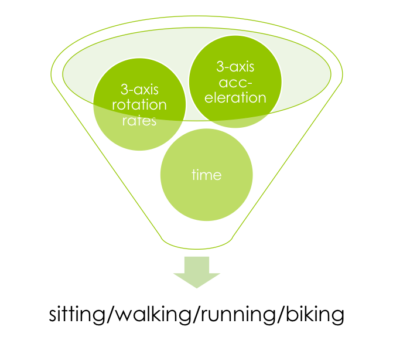
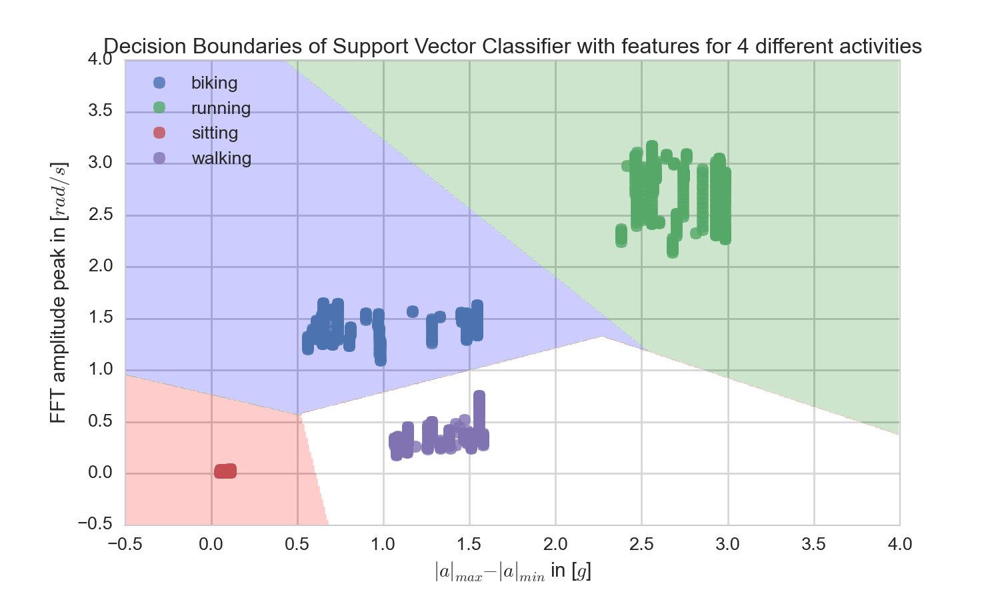

# ActionClassification
Using Acceleration and Rotationrate of a Device to estimate if sitting, running, biking or walking

See [Video on Vimeo](https://vimeo.com/mechlabengineering/activityclassification)

## Support Vector Classfier

Features used:

* difference of absolute acceleration
* FFT amplitude peak of rotation rate

## Live Demo

with [Tinkerforge IMU](http://www.tinkerforge.com/en/doc/Hardware/Bricks/IMU_Brick.html) with `TinkerLiveClassification.py` (change to your UID)

